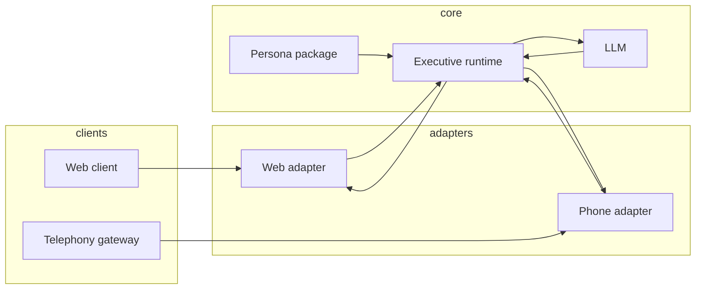

# 3D Avatar + Phone Voice — Design

**Status:** Approved (2026-03-20)  
**Product goal:** Virtual executives appear as **3D talking avatars** in the web app and can hold **real PSTN conversations** (inbound and outbound), sharing one **executive runtime** (persona + LLM + future tools).

---

## Context

The current app (`create-virtual-executive`) generates a six-file persona package and provides **text chat** via `POST /api/chat` (`app/api/chat/route.ts`) using `loadPersonaPackage` + `buildChatSystemPrompt` from `lib/personas/store.ts`. There is no audio, telephony, or 3D rendering today.

---

## Design principle: one runtime, two adapters

| Surface | Input | Output | Adapter |
|--------|--------|--------|---------|
| **Web** | Mic (optional) or text | Text + streamed TTS + viseme/lip-sync targets for 3D | Browser: STT → HTTP/WebSocket to runtime → TTS playback + avatar drivers |
| **Phone** | PSTN audio | PSTN audio | Telephony gateway media stream → STT → runtime → TTS → stream back |

**Executive runtime** (server-side, shared):

- Load persona via existing store (`loadPersonaPackage`, `buildChatSystemPrompt`).
- Maintain conversation state per `sessionId` (messages or window + summary).
- Call Anthropic (existing pattern in `app/api/chat/route.ts`).
- Emit **assistant text**; optionally chunk for **low-latency TTS** (sentence/clause boundaries).

Adapters only handle transport and codec concerns (web vs μ-law PCM, etc.).

---

## Web: 3D avatar + voice

- **3D stack (recommended):** React Three Fiber + `three`, with avatars in **glTF** or **VRM**. Lip-sync: **blendshapes / visemes** driven by TTS provider metadata or a dedicated audio→viseme step.
- **Voice path:** `getUserMedia` → streaming **STT** → runtime → streaming **TTS**; keep **text** as fallback in UI for debugging and accessibility.
- **Timing:** Prefer a single clock for audio playback and mouth pose where possible to reduce lip drift.

---

## Phone: PSTN

- **Gateway:** Twilio, Vonage, or Telnyx (prototype default assumption: **Twilio** for docs/examples).
- **Media:** Provider **media streams** → dedicated **voice worker** (long-lived WebSocket service; may be separate from Vercel serverless due to connection duration).
- **Inbound:** Map called number (and optionally CLI) to `personaId` or routing table.
- **Outbound:** API-triggered calls; same pipeline.
- **Phone-specific behaviors:** Barge-in (interrupt TTS when user speaks), voicemail/heuristics, DTMF, optional **human handoff**.

---

## Phased delivery (parallel tracks, ordered integration)

Engineering can parallelize **web** and **phone**, but integration order reduces risk:

1. **Extract executive runtime** — shared module used by `/api/chat` and future voice routes; behavior unchanged for text chat.
2. **Web:** Text chat + **TTS playback** (no 3D) → then **mic + STT** → then **3D + lip-sync**.
3. **Phone:** **Inbound** single number → STT/runtime/TTS loop → **barge-in** → **outbound**.

---

## Non-goals (for v1)

- Claiming **perfect** human indistinguishability in product or legal copy.
- Replacing disclosure, consent, and abuse policies with technology alone.

---

## Compliance, safety, and quality

- **Disclosure:** Plan explicit scripts/disclosure for synthetic callers where required (jurisdiction- and carrier-dependent).
- **Recording consent:** Treat calls as regulated; document retention and notice.
- **Abuse:** Rate limits (existing optional Upstash middleware), caps on concurrent calls, auth/billing before wide outbound.
- **Latency:** Budget end-to-end; use streaming STT, chunked TTS, and concise persona instructions where helpful.

---

## Open technology choices (to decide during implementation)

| Area | Options / notes |
|------|-------------------|
| STT | Deepgram, AssemblyAI, Google, OpenAI realtime, etc. |
| TTS | ElevenLabs, Cartesia, Amazon Polly, OpenAI, etc. (streaming + phone codec support matters) |
| Avatar assets | Ready Player Me, custom glTF, VRM pipeline |
| Hosting voice worker | Fly.io, Railway, ECS, etc. (long-lived WebSockets) |

---

## Related documents

- Implementation tasks: [`2026-03-20-3d-avatar-phone-voice-implementation-plan.md`](./2026-03-20-3d-avatar-phone-voice-implementation-plan.md)
- Persona spec: [`../vendor/virtual-employee-creator-SKILL.md`](../vendor/virtual-employee-creator-SKILL.md)
